```{r setup, include=FALSE}
knitr::opts_chunk$set(echo = TRUE)
```


## Git, GitHub, GitLab

Git est un système de gestion de version distribué pour  

    - tracker les changement dans les fichiers texte
    - gérer l'historique du code source
    - partager le code avec des dépots distants
  
  
GitHub et GitLab hébèrgent des dépots distants + des services pour gérer des projets (issue tracking, collaboration, hébergement web, CI/CD)


GitLab a un modèle open-core. Possibilité d'héberger une instance. 


## Objectif de l'atelier

### **Configurer Git et GitHub pour partager une présentation et son code source.**


## Les étapes

1. Créer un compte GitHub  
2. Installer Git sur sa machine  
3. Configurer Git sur sa machine
4. Connecter sa machine à son compte GitHub
5. Créer un repo Git
6. Mettre à jour son repo Git
7. Diffuser sa présentation au format html via GitHub


## Créer un compte GitHub  

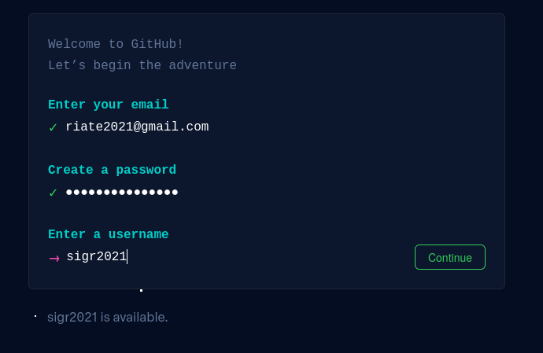

https://github.com/signup


## Créer un compte GitHub

Quelques suggestions pour choisir votre *username*

* Utiliser votre vrai nom
* Réutiliser un *username* que vous utilisez déjà (par ex. @twitter)
* Le plus court c'est le mieux
* ...  

<font size="2">https://happygitwithr.com/github-acct.html#username-advice</font>


## Installer Git sur sa machine  

Ouvrir le terminal dans RStudio

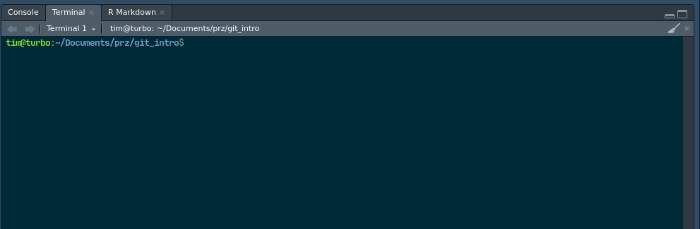

## Installer Git sur sa machine

Dans le terminal : 

```{sh}
which git
git --version
```

Si ça marche, Git est déjà installer. Sinon...

## Installer Git sur sa machine

* Windows  
https://git-scm.com/download/win

* macOS  
http://git-scm.com/download/mac

* Linux /  Unix    
`$ apt install git`


## Installer Git sur sa machine

Dans le terminal :

```sh
git config --global user.name 'username-de-github'
git config --global user.email 'email-de-github@cnrs.com'
git config --global --list
```


## Connecter votre machine et GitHub

Il existe 2 méthodes pour faire le lien entre votre machine et GitHub :   

- Un système de jetons (*token*) pour utiliser le HTTPS  
- Un système de clefs SSH pour se connecter... en SSH  

## Avez vous déjà une paire de clefs SSH
Dans le terminal :

```{sh}
ls -al ~/.ssh/
```

Si vous voyez une paire de fichier `id_rsa` / `id_rsa.pub`, vous avez déjà une paire de clefs SSH. 
Vous pouvez passer les étapes de génération de clefs. 


## Générer une paire de clefs SSH

Dans le terminal : 

```sh
ssh-keygen -t rsa -b 4096 -C "timothee.giraud@cnrz.com"
```

## Générer une paire de clefs SSH
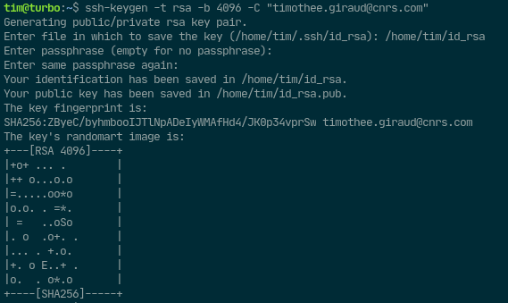

Vous pouvez ajouter une *passphrase* ou non.   

2 fichiers sont créés: 

- une clef privée (`~/.ssh/id_rsa`)  
- une clef publique (`~/.ssh/id_rsa.pub`)


## Générer une paire de clefs SSH

La clef publique (`~/.ssh/id_rsa.pub`) devra être indiquée dans les paramètres de votre compte GitHub.   

La clef privée devra être connue de votre OS (avec `ssh-agent`).  


## Ajouter la clef publique sur GitHub


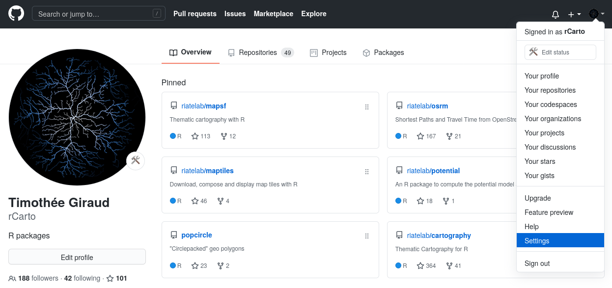

## Ajouter la clef publique sur GitHub


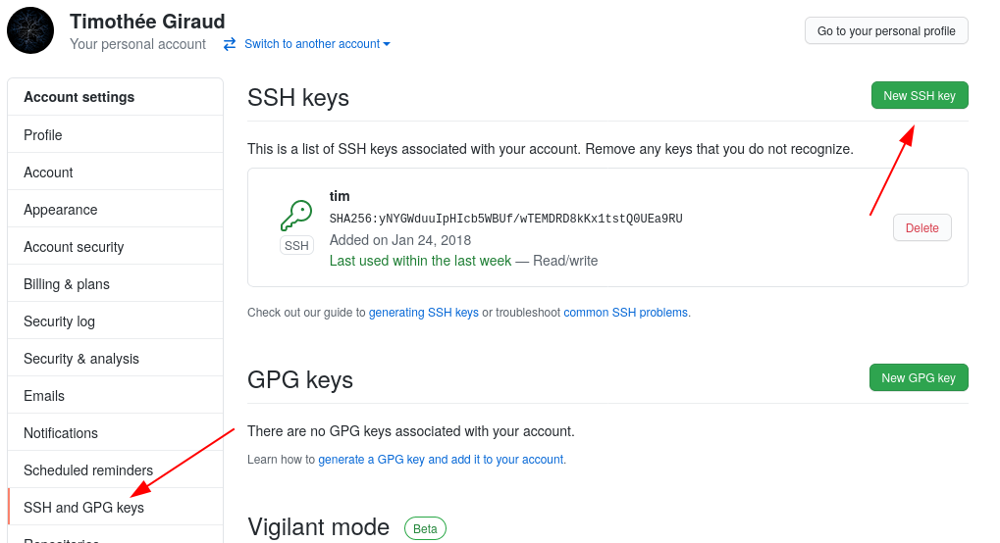


## Ajouter la clef publique sur GitHub
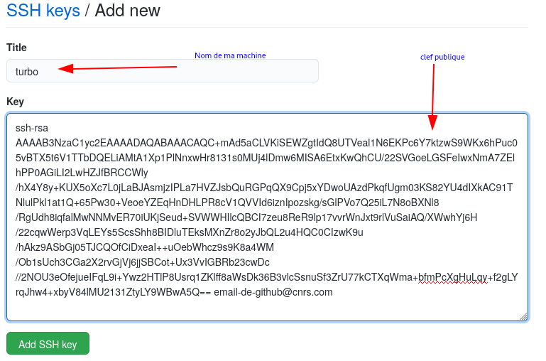  
<small>Copier ici le contenu du fichier `~/.ssh/id_rsa.pub`</small>


##  Ajouter la clef privée à votre `ssh-agent`

Dans le terminal, vérifier que `ssh-agent` est activé : 
```{sh}
eval "$(ssh-agent -s)"
```

Ajouter la clef privée (linux/windows) :  
```sh
ssh-add ~/.ssh/id_rsa
```
Ajouter la clef privée (Mac OS) :    
L'opération est un peu plus compliquée, suivre les instructions suivantes https://happygitwithr.com/ssh-keys.html#mac-os

## Vérifier l'installation

Dans le terminal
```{sh, eval  = FALSE}
ssh -T git@github.com
```
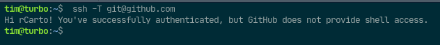


## Créer un repo git

Plusieurs workflows sont possibles pour paramétrer un projet Git/GitHub/Rstudio :   

- **Un nouveau projet, en commençant par GitHub**  
- Un projet existant, en commençant par GitHub  
- Un projet existant, en finissant par GitHub  


## Créer un dépôt sur GitHub

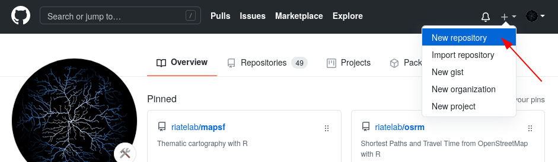

## Créer un dépôt sur GitHub
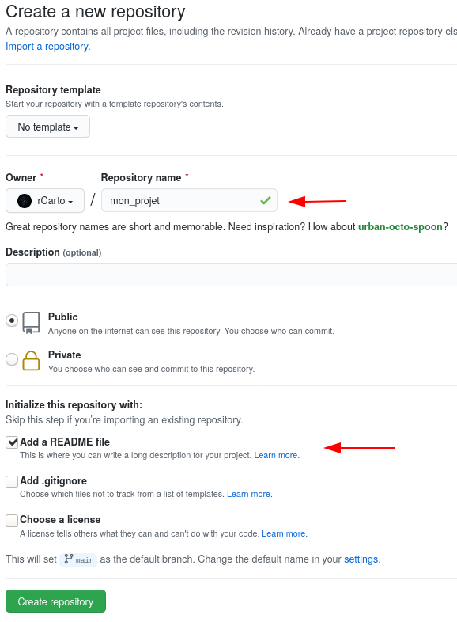

## Créer un dépôt sur GitHub
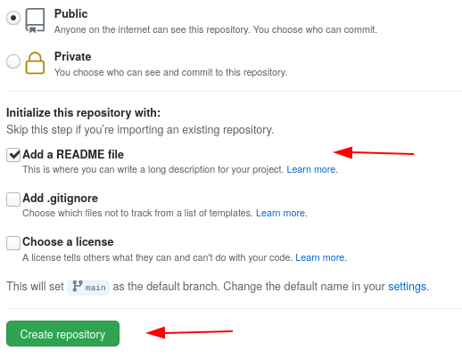

## Créer un dépôt sur GitHub
Copier l'adresse ssh du dépôt.   
  
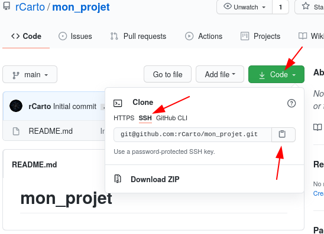


## Cloner le dépôt sur sa machine
Dans le terminal :

```{sh, eval = F}
git clone git@github.com:rCarto/mon_projet.git
```

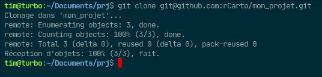

## Créer un projet
Dans RStudio :   

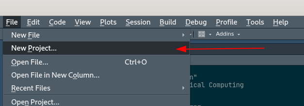

## Créer un projet
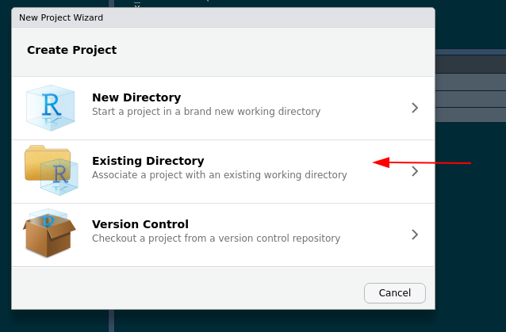

## Créer un projet
Indiquer le dossier que l'on vient de cloner.   

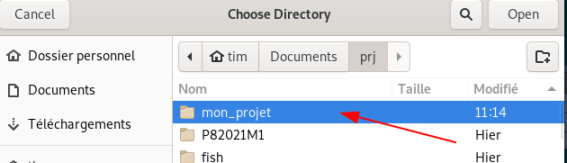


## Créer un projet
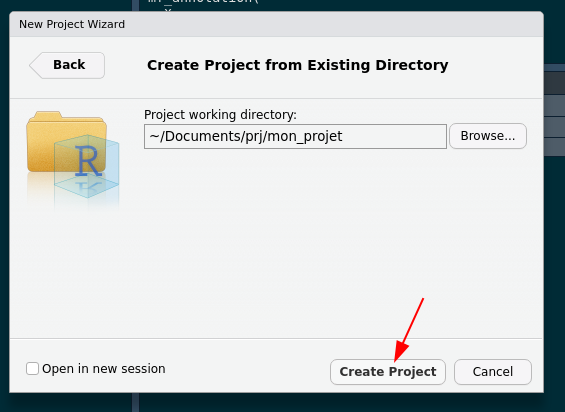


## Créer une nouvelle présentation 

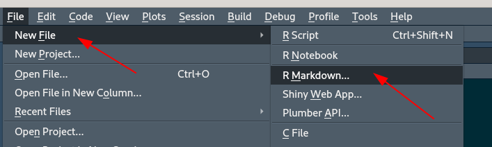  
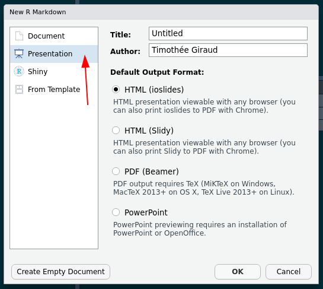


## Créer une nouvelle présentation 
Enregistrer et tricoter la présentation sous le nom `index.Rmd`.    
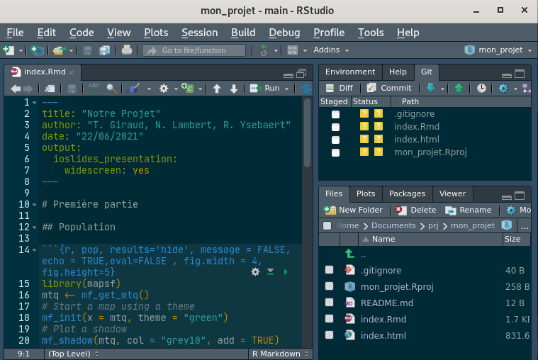

## *Commiter* ses changements
*À faire à chaque fois que l'on a fini une étape significative de travail, surement plusieurs fois par jour.*  

Commiter c'est enregistrer localement (sur sa machine) ses changements pour Git. 

## *Commiter* ses changements

- Cliquer sur l'onglet Git.
- Cocher la boite "*Staged*" devant tous les fichiers dont on veut enregistrer l'existense ou le changement.
- Cliquer sur "*Commit*"  

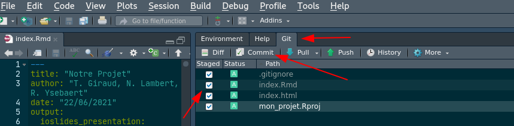

## *Commiter* ses changements

Indiquer un message pour le *commit*, puis cliquer sur "*Commit*".   

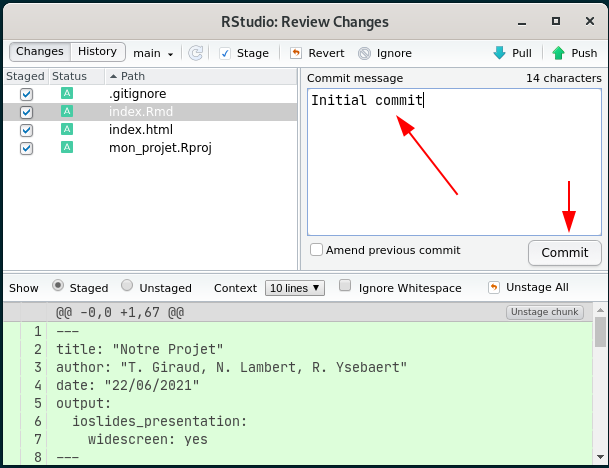

## *Commiter* ses changements

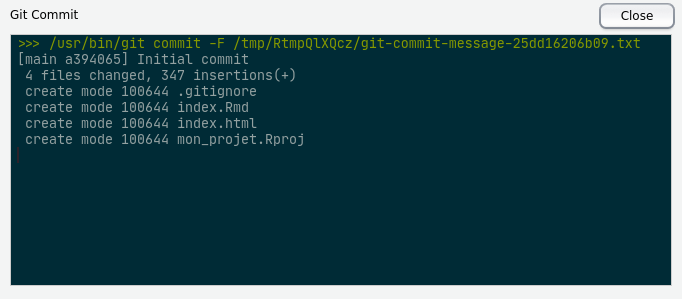

## Pousser ses modifications

*À faire quelques fois par jour, moins souvent que les commits.*    

Pousser ses modifications (*Push*) c'est envoyer ses modifications sur le dépôt distant sur GitHub. 

## Pousser ses modifications

**Attention**, il faut d'abord Tirer (*Pull*) depuis GitHub. Cela permet de prendre en compte les modifications faites sur le dépôt par une autre machine ou par un collègue. Cela permet de s'assurer que l'on est à jour avec le dépôt distant.     

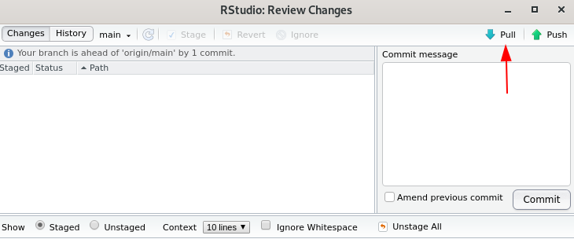 

## Pousser ses modifications

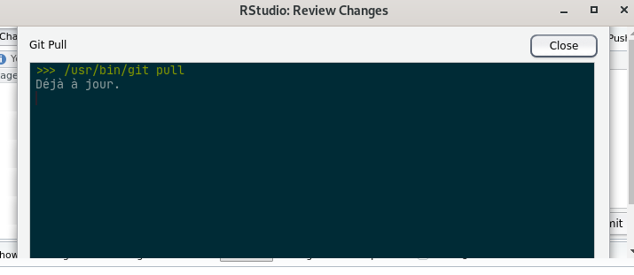

## Pousser ses modifications

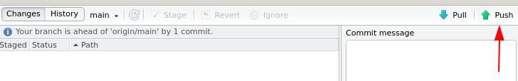

</br>

</br>


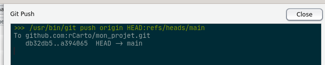

## Vérifier les changements sur GitHub

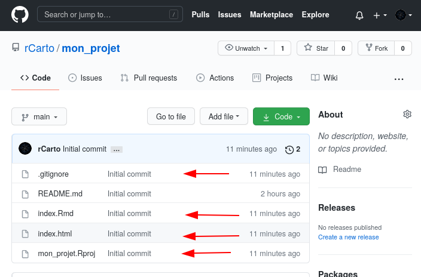

## Mettre en ligne (servir) la présentation
Les GitHub Pages permettent de mettre en ligne des fichiers html/css/javascript.   


Dans les *settings* du dépôt sur GitHub =>

## Mettre en ligne (servir) la présentation

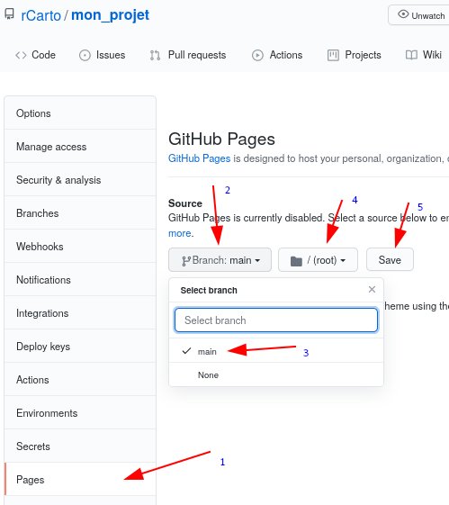


## Mettre en ligne (servir) la présentation
Après quelques instants la présentation sera accessible en ligne à l'adresse indiquée!  
Elle sera automatiquement mise à jour à chaque fois que le dépôt est mis à jour (*Push*). 

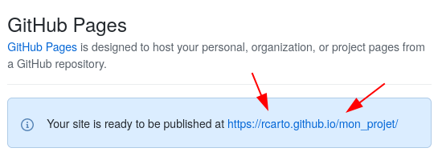

## Mettre en ligne (servir) la présentation

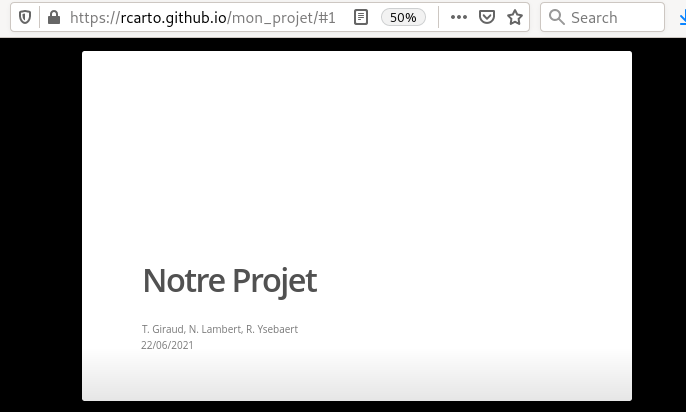


## Ressource
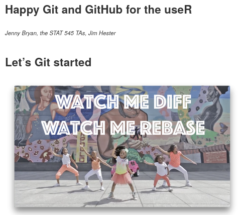  
[https://happygitwithr.com/](https://happygitwithr.com/)

https://ohshitgit.com/

##
```{r, echo = FALSE}
options(width="110")
x <- sessionInfo()
print(x, locale=FALSE, RNG = F)


