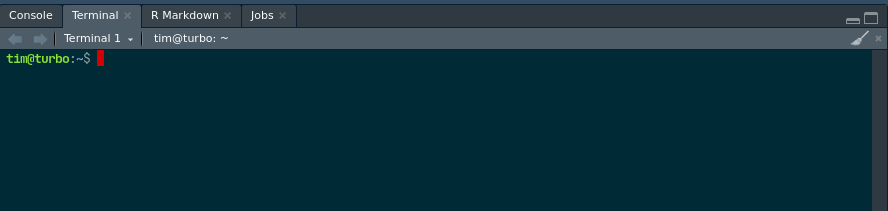

```{r setup, include=FALSE}
knitr::opts_chunk$set(echo = TRUE)
```


## Git, GitHub, GitLab

Git est un système de gestion de version distribué pour  

    - tracker les changement dans les fichiers texte
    - gérer l'historique du code source
    - partager le code avec des dépots distantes
  
  
GitHub et GitLab hébèrgent des dépots distants + des services pour gérer des projets (issue tracking, collaboration, hébergement web, CI/CD)


GitLab a un modèle open-core. Possibilité d'héberger une instance. 


## Objectif de l'atelier

### Configurer Git et GitHub pour partager une présentation et son code source.


## Les étapes

1. Créer un compte GitHub  
2. Installer Git sur sa machine  
3. Configurer Git sur sa machine
4. Connecter sa machine à son compte GitHub
5. Créer un repo Git
6. Mettre à jour son repo Git
7. Diffuser sa présentation au format html via GitHub


## Créer un compte GitHub  


https://github.com/signup


## Créer un compte GitHub

Quelques suggestions pour choisir votre *username*

* Utiliser votre vrai nom
* Réutiliser un *username* que vous utilisez déjà (par ex. @twitter)
* Le plus court c'est le mieux
* ...  

<font size="2">https://happygitwithr.com/github-acct.html#username-advice</font>


## Installer Git sur sa machine  

Ouvrir le terminal dans RStudio



## Installer Git sur sa machine

Écrire 

```{sh}
which git
```

et 

```{sh}
git --version
```

Si ça marche, Git est déjà installer. Sinon...

## Installer Git sur sa machine

* Windows  
https://git-scm.com/download/win

* macOS  
http://git-scm.com/download/mac

* Linux /  Unix    
`apt install git`


## Configurer Git sur sa machine

Dans le terminal

```sh
git config --global user.name 'Riate 2021'
git config --global user.email 'riate2021@gmail.com'
git config --global --list
```


## Connecter votre machine et GitHub

Il existe 2 méthodes pour faire le lien entre votre machine et GitHub :   

- Un système de jetons (*token*) pour se uttiliser le HTTPS  
- Un système de clefs SSH pour se connecter... en SSH  


## Créer une paire de clef SSH

Dans le terminal, tapez : 

```bash
ssh-keygen -t rsa -b 4096 -C "your@e-mail.com"
```

Cela va créer 2 fichiers : 

- une clef privée (`~/.ssh/id_rsa`)  
- une clef publique (`~/.ssh/id_rsa.pub`)


## Créer une paire de clef SSH

La clef publique (`~/.ssh/id_rsa.pub`) devra être indiquée dans les paramètres de votre compte GitHub

La clef privée devra être connue de votre OS.


##  Ajouter la clef privée à votre ssh-agent


## Ajouter la clef publique sur GitHub

- Copier le contenu du fichier ~/.ssh/id_rsa.pub


## Créer un repo git

Créer le repo dans GitHub
Le cloner sur sa machine
git add
git commit 
git push


## Servir un markdown
Grace au GH pages


## Ressource
  
[https://happygitwithr.com/](https://happygitwithr.com/)


##
```{r, echo = FALSE}
options(width="110")
x <- sessionInfo()
print(x, locale=FALSE, RNG = F)


